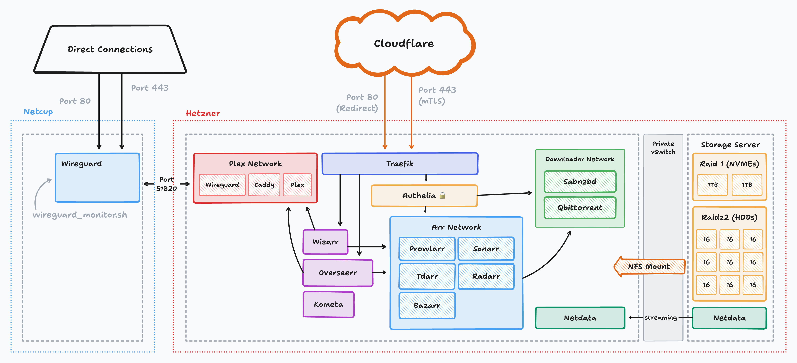

# Mediaserver

WIP

Usage

copy `.example.yaml` files in `host_vars/` and `group_vars/`

copy `inventory.example.ini` to `inventory.ini`

edit `inventory.ini` to include your hosts

install ansible collections and roles:

`ansible-galaxy collection install -r requirements.yaml`

`./run.sh`
