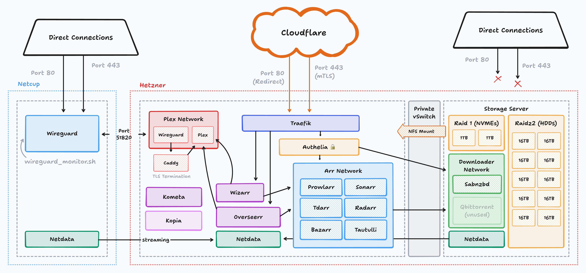

# Mediaserver

Usage

copy `.example.yaml` files in `host_vars/` and `group_vars/`

copy `inventory.example.ini` to `inventory.ini`

edit `inventory.ini` to include your hosts

install [`devenv`](https://devenv.sh/getting-started/)

`$ install`

`$ run`
